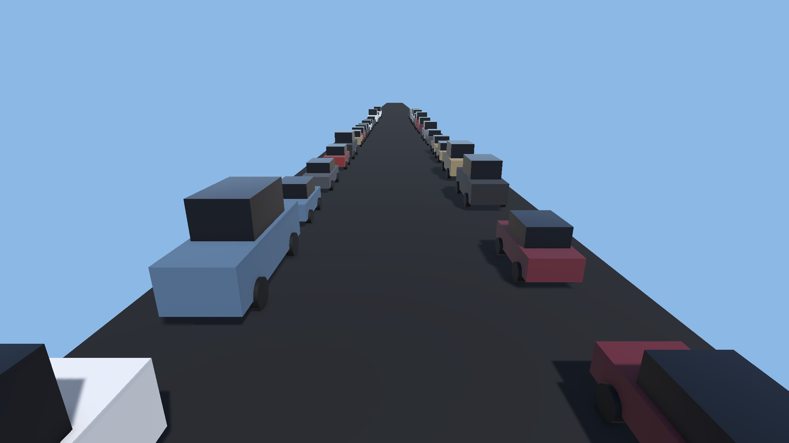

# Ambient Traffic Jam



Cosmetic stop-and-go background traffic for Unity. Cars pack bumper-to-bumper in lanes, follow the
car ahead (accelerating to close a gap, braking to a stop), and drift between random go/stop phases
so pauses ripple backward as real stop-and-go waves — the classic highway traffic-jam look, running
entirely as background dressing behind your gameplay.

## Overview & Features

- **Self-filling lanes.** Assign lane positions and prefabs; the lane packs itself bumper-to-bumper
  from a mix of your car/bus/truck prefabs — no car-count field to tune.
- **Realistic stop-and-go jam behaviour.** Cars accelerate to a crawl, brake to a safe following
  distance, and pause for randomized stop phases, so the line surges and stalls in backward-traveling
  waves instead of moving in lockstep.
- **Camera-anchored recycling window.** A window of cars tracks an anchor (typically the camera); cars
  that fall off the rear edge are recycled to the front, keeping the belt full indefinitely with a
  bounded number of live cars.
- **Zero-cost colliders by default.** Colliders are off for normal play (no physics overhead) and can
  be woken on demand near a target — e.g. for a death/impact — via a single method call.
  Colliders are asleep at all other times; there is no way for the ambient traffic to accidentally push,
  block, or otherwise interfere with gameplay unless you explicitly wake them.
- **Randomized body colour** from a weighted palette, implemented with shared material *variants*
  (never per-object property blocks) so every car stays SRP-batched.
- **Looping, distance-gated move SFX.** Each car fades a looping engine/tyre bed in while it creeps and
  out while it's stopped, with an earshot cutoff so only nearby moving cars cost an audio voice.
- **Deterministic-friendly.** All randomness (spawn, prefab pick, phase timing, colour, pitch) comes
  from a private RNG instance, so it never disturbs a seeded gameplay RNG.

## Requirements

- **Unity 6000.3 or newer** (Unity 6).
- **Universal Render Pipeline (URP).** The colour-variety feature drives the `URP/Lit` shader's
  `_BaseColor` property and relies on the SRP Batcher to keep every car in one batch. The package will
  still run under a different pipeline, but the tint feature assumes a `URP/Lit`-compatible body
  material.

## Quick Start

1. Add the **Ambient Traffic** component to a GameObject in your scene (an empty object near your
   road/level root works well).
2. Add one or more entries to **Lanes**. For each lane set `Lane X` (distance from road centre),
   `Right Side` (which side of the road it drives on), and assign at least one car prefab.
3. Assign your own car prefabs to each lane's **Prefabs** array — any prefab with a Renderer works;
   its bounds are measured automatically to pack cars bumper-to-bumper regardless of size.
4. Press **Play**. Lanes fill automatically and the jam starts creeping.

To see it working end to end (colour variety, move SFX, and impact collisions all wired up), open the
included **Demo** scene under `Assets/AmbientTraffic/Demo/` — it's a ready-made reference setup you can
copy settings from.

## Inspector Reference

### Lanes

| Field | Meaning |
|---|---|
| `lanes` | One entry per traffic lane (`TrafficLane[]`). Position each lane's `\|x\|` so traffic sits clear of wherever your gameplay happens; the middle is typically left open for the player. Each lane auto-fills bumper-to-bumper — there is no car-count field. |
| `groundY` | World Y at which cars are placed. |

Each `TrafficLane` entry has its own fields:

| Field | Meaning |
|---|---|
| `laneX` | Lane `\|x\|` distance from road centre (always positive; side comes from `rightSide`). |
| `rightSide` | `true` = right side (+x), driving with the camera (facing +z). `false` = left side (-x), oncoming (facing -z). |
| `crawlSpeed` | Max creep speed for cars in this lane. Keep it well below the camera/player travel speed so the jam reads as near-stationary traffic. |
| `prefabs` | Vehicles used for this lane only (assign at least one). Different lanes may use different prefab sets — e.g. keep buses/trucks to an outer lane. |

### Jam

| Field | Meaning |
|---|---|
| `gapDesired` | Bumper-to-bumper gap kept between a car's nose and the tail of the car ahead, in world units. This is **the** density knob — larger means a looser jam (fewer cars, less rendering cost), smaller means tighter gridlock. A car brakes to a full stop exactly this far behind the car ahead. |
| `accel` | How fast a car eases up to its crawl speed (units/s²). Gentle values read as a relaxed creep. |
| `brake` | How fast a car eases down to a stop (units/s²). Also used as the safe-following brake that guarantees a car never overruns the one ahead. |
| `brakeGap` | Braking distance — how close a car's nose gets to the tail of the car ahead before it must brake to a full stop. Deliberately much smaller than `gapDesired`: a car sitting at the packed spacing still has `gapDesired - brakeGap` of headroom to creep at crawl, so the line behaves as a moving conveyor instead of freezing solid. Keep it small — a fraction of `gapDesired`. |
| `moveDistance` (min/max) | How far a car travels each time it moves, in multiples of its own length (random pick per move). This is a distance budget, not a time budget — it's only consumed by actual forward progress, so a car blocked bumper-to-bumper still travels its full pull-up once the gap ahead opens. `1.0` = exactly one car length; bigger values read as longer, more flowing surges; smaller values read as short shuffles. |
| `stopDuration` (min/max) | Random "stop" phase length in seconds after a car finishes a move, staggered per car so the line starts and stops in backward-traveling waves rather than in unison. Short values read as a flowing jam; longer values read as heavier gridlock. (A car can sit still longer than this while simply blocked by a stopped car ahead — that's waiting, not a stop phase.) |

### Colour Variety

| Field | Meaning |
|---|---|
| `randomTint` | Gives each car a random body colour for variety. Implemented as a small pool of colour-variant materials (same `URP/Lit` shader) assigned to the body-paint slot only, so the SRP Batcher still batches every car with no extra draw-call cost. Wheels, lights, and glass keep their atlas look. Colour multiplies the shared city atlas, so a vehicle with a baked livery (e.g. taxi/police/ambulance) tints less cleanly than a plain body. |
| `tintColors` | The palette a car's body colour is picked from at random, one variant material per entry. The default is a realistic distribution weighted toward neutrals (white/silver/greys/black) with a few muted colours. Colour multiplies the shared atlas, so keep entries in a realistic range — a pure-bright entry reads as light grey rather than white. Duplicate an entry to make it more common. |

### Impact Collision

| Field | Meaning |
|---|---|
| `impactCollision` | Enables optional impact colliders. Colliders are off for the entire normal run (zero physics cost); call `TriggerImpactCollisions(target, duration)` to wake box colliders on cars near a target for a few seconds — e.g. on a death/impact. Requires the traffic layer to exist and to collide with your object's layer in the physics matrix. |
| `colliderWakeRadius` | Cars within this radius of the impact target get their collider enabled. Refreshed every frame, so the wake radius follows the target. |
| `impactColliderDuration` | Default number of seconds to keep waking nearby colliders, used when `TriggerImpactCollisions` is called with `duration <= 0`. |
| `trafficLayerName` | Physics layer assigned to car colliders. Must already exist in **Project Settings > Tags and Layers**. |
| `collideWithLayerName` | Optional: a layer name the traffic layer should be made to collide with at runtime (`Physics.IgnoreLayerCollision(..., false)`). Leave empty to configure the physics matrix yourself in Project Settings. |
| `impactTarget` | Optional default impact target. `TriggerImpactCollisions` overrides this whenever it's called with a non-null target. |

### Window (relative to anchor)

| Field | Meaning |
|---|---|
| `windowAnchor` | Optional transform the recycling window follows. Leave empty to use `Camera.main`; the window (and audio-listener distance) track this transform's Z. |
| `windowAhead` | How far ahead of the anchor the window reaches. The window follows the anchor, so set this as far as your camera can actually see — otherwise the jam will visibly end at the window edge. Cars that fall off the rear edge recycle to the front to keep the belt full. |
| `windowBehind` | How far behind the anchor the window reaches before a car is recycled to the front. |

### Move SFX

| Field | Meaning |
|---|---|
| `passByClips` | Steady, low, loopable ~1.5s engine/tyre-roll beds, one picked at random per car. These are not whoosh one-shots — each car's source loops, fading its volume in when the car starts creeping and out when it stops, so the sound plays for exactly as long as the car is moving. A stopped car in the jam is silent even right next to the listener; only a car actually creeping is heard. |
| `passByFadeTime` | Fade in/out time in seconds for a car's move loop as it starts/stops creeping. Short values feel snappy; longer values give a gentler swell. The clip itself is constant-volume, so this envelope is the only volume shaping. |
| `passByPitch` (min/max) | Random pitch per car so shared clips don't all sound identical. Pitch is already low in the clips themselves (low-speed engine, not a highway whoosh) — this only adds mild per-car variation around 1. |
| `passByVolume` | Peak playback volume. Keep these as background ambience — higher reads as annoying/foreground. |
| `passByMinDistance` | Linear-rolloff near distance. The listener sits on the camera (roughly 10–13 units from a passing car), so this must cover that distance or every car will sound pre-attenuated. |
| `passByMaxDistance` | Linear-rolloff far distance. Also gates which moving cars get an active, playing loop — only cars within earshot cost an audio voice. |

### References

| Field | Meaning |
|---|---|
| `parent` | Transform spawned cars are parented under. Defaults to this component's own transform if left unassigned. |

## Public API

### `void ClearTraffic()`

Despawns all ambient traffic — every spawned car is deactivated. Use it when a round or level ends
(e.g. reaching a finish line) and you no longer want background traffic on screen. Per-round reset is
expected to happen via scene reload, since the component and its cars are recreated fresh each round.

```csharp
using FuR.AmbientTraffic;
using UnityEngine;

public class FinishLineTrigger : MonoBehaviour
{
    public AmbientTraffic traffic;

    void OnTriggerEnter(Collider other)
    {
        if (!other.CompareTag("Player")) return;
        traffic.ClearTraffic();
    }
}
```

### `void TriggerImpactCollisions(Transform target, float duration = 0f)`

Wakes box colliders on the cars near `target` for `duration` seconds, so a moving object (e.g. a
falling/crashing player) bumps into cars instead of passing through them. Colliders are otherwise
disabled for zero physics cost. Pass `duration <= 0` to fall back to `impactColliderDuration`. Safe to
call repeatedly — the follow window simply restarts.

```csharp
using FuR.AmbientTraffic;
using UnityEngine;

public class PlayerDeath : MonoBehaviour
{
    public AmbientTraffic traffic;

    void OnDeath()
    {
        // Wake nearby car colliders around the player for 5 seconds.
        traffic.TriggerImpactCollisions(transform, 5f);
    }
}
```

`TriggerImpactCollisions` is a no-op unless all of the following are true:

- `impactCollision` is enabled on the `AmbientTraffic` component.
- The layer named by `trafficLayerName` exists in **Project Settings > Tags and Layers**.
- The physics collision matrix allows that layer to collide with the target's layer — either set this
  up yourself in **Project Settings > Physics**, or set `collideWithLayerName` to have it configured
  automatically at startup.

## URP & SRP Batcher Note

The colour-variety feature (`randomTint` / `tintColors`) works by swapping a car's body-paint material
slot to one of a small pool of pre-built colour *variant materials*, all sharing the same `URP/Lit`
shader. This is deliberate: a **shared material variant** keeps every car eligible for the SRP Batcher,
so tinting hundreds of cars costs nothing in draw calls. A `MaterialPropertyBlock`-based per-object tint
would be the more obvious approach, but it **breaks SRP batching** for every object using it — that
approach is intentionally not used here. If you replace the body material, keep it on `URP/Lit` (or an
SRP-Batcher-compatible shader) and keep the paint colour in slot 0 of the body renderer so tinting keeps
working.

## Performance & Tuning

- **`gapDesired` is the density knob.** It directly controls both how packed the jam looks and how
  many cars exist at once (looser gaps -> fewer cars in the window -> lower rendering cost). Tune this
  first if you need to trade jam density for performance.
- **`windowAhead` should reach as far as your camera actually sees.** Because the window follows the
  anchor, setting `windowAhead` shorter than your visible draw distance makes the jam visibly end
  mid-view. Match it to your fog/far-clip distance, and no further — a bigger window than necessary
  only spawns more cars for no visual benefit.
- **Move SFX is voice-gated by earshot.** Only cars that are both moving and within `passByMaxDistance`
  of the listener keep an active, playing `AudioSource`; everything else is silent and effectively free.
  Raising `passByMaxDistance` increases how many simultaneous voices can play — keep it as tight as your
  scene allows.
- **Impact colliders cost nothing until triggered.** All car colliders are disabled at spawn; only
  `TriggerImpactCollisions` wakes the handful of colliders within `colliderWakeRadius`, and only for the
  requested duration.

## Troubleshooting / FAQ

**Cars overlap / clip into each other.**
Check the car prefab's renderer bounds — spacing is measured from the combined world-space renderer
bounds at spawn, so a prefab with missing or mis-scaled renderers can under-report its length. Also
check `gapDesired`; a very small value packs cars close enough that visual clipping becomes more likely
with imperfect prefab bounds.

**No audio from the traffic.**
Make sure `passByClips` has at least one clip assigned (an empty array means no car ever gets an
`AudioSource`), and confirm there's an `AudioListener` on your camera. Also check `passByVolume` isn't
zero and that the listener is within `passByMinDistance`/`passByMaxDistance` of the lane.

**Impact colliders never fire.**
Confirm `impactCollision` is enabled on the component, that the layer named in `trafficLayerName` exists
under **Project Settings > Tags and Layers**, and that the physics collision matrix in **Project
Settings > Physics** allows that layer to collide with your target's layer (or set
`collideWithLayerName` so it's configured automatically at startup).

**All cars are one colour.**
`randomTint` only tints the renderer it identifies as the "body" renderer — the one with more than one
material slot (body paint + lights). If your prefab's body paint lives on a single-material renderer
alongside other multi-material renderers, the wrong renderer may be picked; consolidate the body-paint
material onto the renderer that also carries the lights/trim materials, or restructure the prefab so the
body renderer is clearly identifiable.
