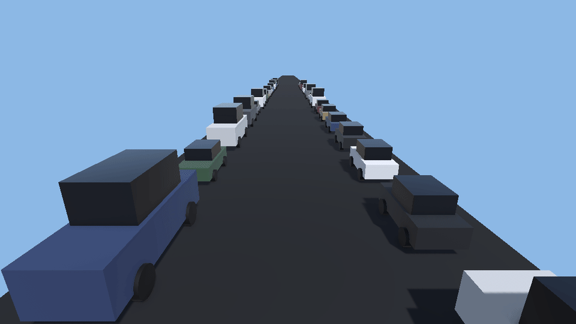
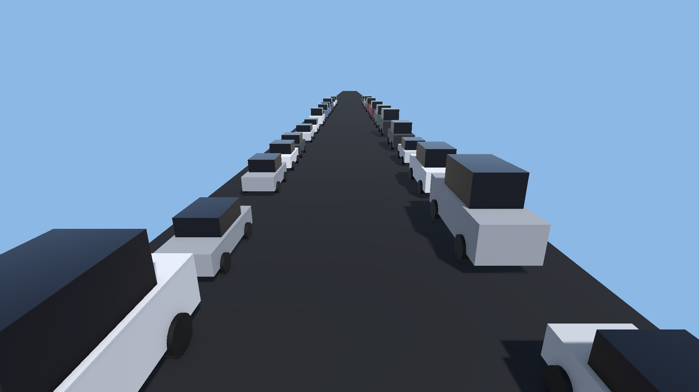
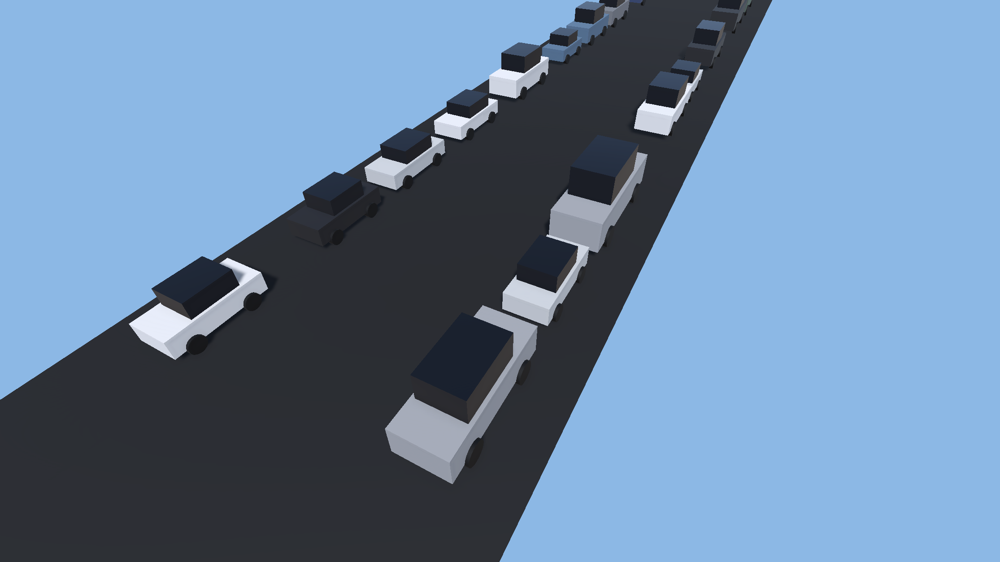
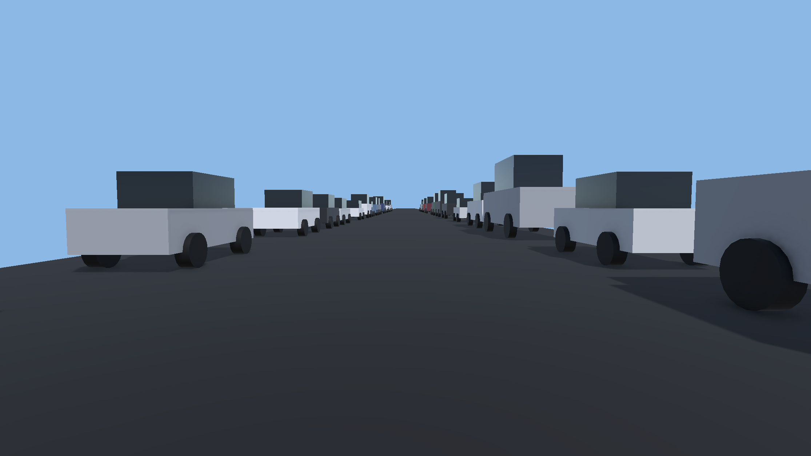
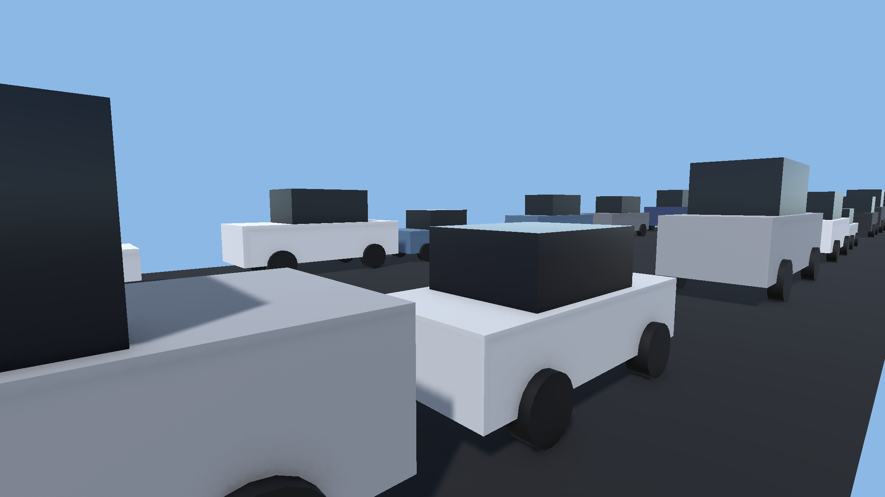

# Ambient Traffic Jam

Cosmetic **stop-and-go background traffic** for Unity (URP). Cars pack bumper-to-bumper in lanes, follow the car ahead (accelerate to close a gap, brake to a stop), and drift between random go/stop phases so pauses ripple backward as real traffic waves. A camera-anchored window recycles cars off the rear edge to the front, keeping the belt full with a bounded number of live cars. No colliders during normal play, deterministic (private RNG), SRP-batched.



## Features
- **Self-filling lanes** — assign lane positions and prefabs; each lane auto-packs bumper-to-bumper from a mix of your car/bus/truck prefabs (no car-count to tune).
- **Realistic stop-and-go waves** — cars creep, brake to a safe following distance, and pause for randomized stop phases, so the line surges and stalls in backward-travelling waves.
- **Camera-anchored recycling** — a window tracks an anchor (usually the camera); cars that fall off the back are recycled to the front, so the jam never "ends".
- **Per-car colour tint** — a weighted palette applied via shared material *variants* (not per-object property blocks), so every car stays SRP-batched.
- **Looping, distance-gated engine SFX** — each car fades a looping engine bed in while it creeps and out while stopped, with an earshot cutoff.
- **Optional impact colliders** — off by default (zero physics cost); wake colliders near a target on demand (e.g. a player death) via one call.
- **Deterministic** — all randomness uses a private RNG, so it never disturbs a seeded gameplay RNG.

## Requirements
- Unity **6000.3+** (Unity 6)
- **Universal Render Pipeline (URP)** — the colour tint drives the URP/Lit `_BaseColor` and relies on the SRP Batcher.

## Quick start
1. Add the **Ambient Traffic** component to a GameObject.
2. Add one or more **Lanes**; set each lane's `laneX` and side, and assign your car prefabs.
3. Press **Play** — lanes fill automatically and the jam starts creeping.

See the ready-made **`Assets/AmbientTraffic/Demo/AmbientTrafficDemo`** scene, and the full manual at **`Assets/AmbientTraffic/Documentation/Documentation.pdf`**.

## Public API
```csharp
// Despawn all ambient traffic (e.g. when the player finishes the level).
ambientTraffic.ClearTraffic();

// Wake impact colliders on cars near a target for a few seconds (needs impactCollision on
// + a Traffic layer configured in the physics matrix).
ambientTraffic.TriggerImpactCollisions(player, 5f);
```

## Install
- **Unity package:** download [`AmbientTrafficJam.unitypackage`](AmbientTrafficJam.unitypackage) and import into a URP project, or
- clone this repo and copy the `Assets/AmbientTraffic/` folder into your project.

## Screenshots
| | |
|---|---|
|  |  |
|  |  |

## License
MIT © 2026 fuR Gaming. Author: Richard Fu ([@furic](https://github.com/furic)). See [`Assets/AmbientTraffic/LICENSE.md`](Assets/AmbientTraffic/LICENSE.md).
